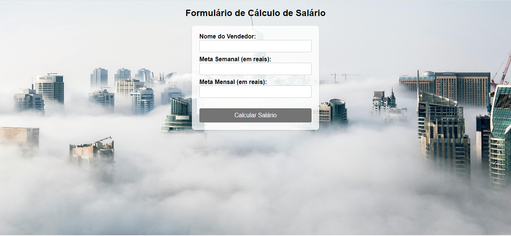
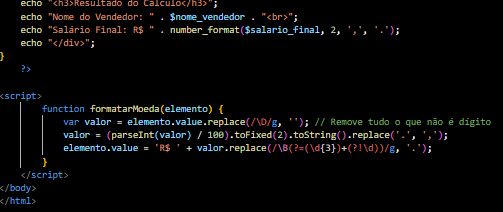
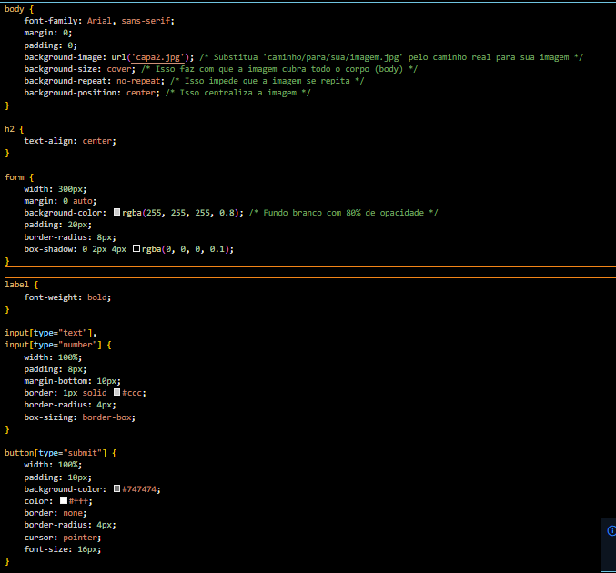
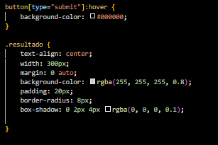

# 🚀 sejam todos bem vindo ao meu repositorio 

## Iindice
   - [Projeto - Loja de carros](#formul%C3%A1rio-de-c%C3%A1lculo-de-sal%C3%A1rio)  
   - [Descrição](#descris%C3%A3o)  
   - [Introdução](#introdu%C3%A7%C3%A3o)  
   - [Funcionalidades](#funcionalidades)  
   - [Tecnologias Utilizadas](#tecnologias-utilizadas)  
   - [Fontes Consultadas](#fontes-consultadas)  
   - [Autores](#autores)  

# 💰Formulário de Cálculo de Salário

# ✅Descrisão 
   esse formulario formulário em php que permite calcular o salário de um vendedor, com base em suas metas semanais e mensais.
# 📃 Introdução
   Este código é um formulário de cálculo de salário para vendedores. Ele permite que você calcule o salário final de um vendedor com b      ase nas metas semanais e mensais, bem como no salário mínimo.
      
   
## 🔧 Funcionalidades
   °Permite que o usuário digite seu nome e as metas semanais e mensais.   
   °Calcula o salário final do vendedor com base nas metas e no salário mínimo.   
   °Exibe o resultado do cálculo com o nome do vendedor e o salário final formatado em reais.

##⚒📖 codigos utilizados no projeto

   aqui está o codigo php, java script e ea estrutura basica do hmtl

   <!DOCTYPE html>
<html lang="pt-BR">
<head>
    <meta charset="UTF-8">
    <meta name="viewport" content="width=device-width, initial-scale=1.0">
    <title>Formulário de Cálculo de Salário</title>
    <link rel="stylesheet" href="css/styles.css"> 
</head>
<body>
    <h2>Formulário de Cálculo de Salário</h2>
    <form action="" method="post">
        <label for="nome">Nome do Vendedor:</label> 
        <input type="text" id="nome" name="nome" required> 
        <label for="meta_semanal">Meta Semanal (em reais):</label> 
        <input type="text" id="meta_semanal" name="meta_semanal" required onkeyup="formatarMoeda(this)"> 
        <label for="meta_mensal">Meta Mensal (em reais):</label> 
        <input type="text" id="meta_mensal" name="meta_mensal" required onkeyup="formatarMoeda(this)">  
        <button type="submit">Calcular Salário</button>
    </form>

    <?php
if ($_SERVER["REQUEST_METHOD"] == "POST") {
    $nome_vendedor = $_POST['nome'];
    
    // Remover caracteres não numéricos e converter vírgulas para ponto nas metas semanal e mensal
    $meta_semanal = str_replace(array('.', ' R$', ','), '', $_POST['meta_semanal']);
    $meta_mensal = str_replace(array('.', ' R$', ','), '', $_POST['meta_mensal']);

    // Converter as metas para números
    $meta_semanal = floatval($meta_semanal);
    $meta_mensal = floatval($meta_mensal);

    // Definir salário mínimo
    $salario_minimo = 1412.00;

    // Calcular bônus e excedentes
    $bonus_semanal = ($meta_semanal * 0.01);
    $excedente_semanal = max(0, ($meta_semanal - 20000) * 0.05);
    $excedente_mensal = max(0, ($meta_mensal - 80000) * 0.10);

    // Calcular salário final
    if ($meta_semanal >= 20000) {
        $salario_final = $salario_minimo + $bonus_semanal + $excedente_semanal + $excedente_mensal;
    } else {
        $salario_final = $salario_minimo + $bonus_semanal;
    }

    echo "
";
    echo "<h3>Resultado do Cálculo</h3>";
    echo "Nome do Vendedor: " . $nome_vendedor . " ";
    echo "Salário Final: R$ " . number_format($salario_final, 2, ',', '.');
    echo "
";
}
    ?>

</body>
</html>

   

   já aqui está todo o css da página
   

   

   essas linguagens servem como:
   HTML: Estrutura da página e formulário
   CSS: Estilização da página
   JavaScript: Formatação de moeda
   PHP: Cálculo do salário e exibição do resultado

## 📌 Tecnologias Utilizadas
   °HTML5    
   °CCS3   
   °PHP8.1   
   °ECMAScript 2023   

## 🔎 Fontes consultadas
   [gov.br](https://www.gov.br/planalto/pt-br/acompanhe-o-planalto/noticias/2023/12/salario-minimo-de-2024-tera-ganho-real-e-crescera-3pp-alem-dos-3-85-da-inflacao)
   [PHP](https://www.php.net/)  
   
## ✒️ Autores
[Leonardo De Oliveira](https://github.com/leoOliveiraBR)  
