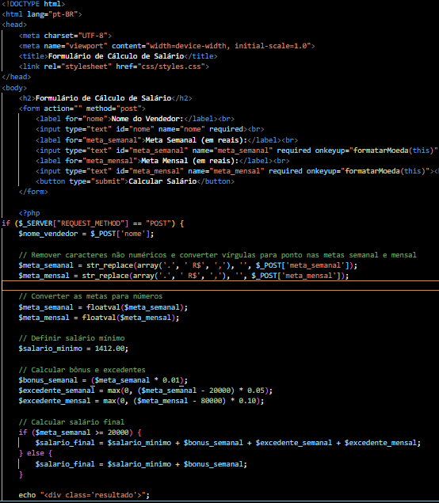

# 🚀 sejam todos bem vindo ao meu repositorio 

## Iindice
   - [Projeto - Loja de carros](#formul%C3%A1rio-de-c%C3%A1lculo-de-sal%C3%A1rio)  
   - [Descrição](#descris%C3%A3o)  
   - [Introdução](#introdu%C3%A7%C3%A3o)  
   - [Funcionalidades](#funcionalidades)  
   - [Tecnologias Utilizadas](#tecnologias-utilizadas)  
   - [Fontes Consultadas](#fontes-consultadas)  
   - [Autores](#autores)  

# 💰Formulário de Cálculo de Salário

# ✅Descrisão 
   esse formulario formulário em php que permite calcular o salário de um vendedor, com base em suas metas semanais e mensais.
# 📃 Introdução

HTML: Estrutura da página e formulário   
CSS: Estilização da página   
JavaScript: Formatação de moeda   
PHP: Cálculo do salário e exibição do resultado   
   
## 🔧 Funcionalidades
   °Permite que o usuário digite seu nome e as metas semanais e mensais.   
   °Calcula o salário final do vendedor com base nas metas e no salário mínimo.   
   °Exibe o resultado do cálculo com o nome do vendedor e o salário final formatado em reais.

## codigos utilizados no projeto

aqui está o codigo php, java script e ea estrutura basica do hmtl

já aqui está todo o css da página

essas linguagens servem como:

HTML: Estrutura da página e formulário
CSS: Estilização da página
JavaScript: Formatação de moeda
PHP: Cálculo do salário e exibição do resultado

## 📌 Tecnologias Utilizadas
   °HTML5    
   °CCS3   
   °PHP8.1   
   °ECMAScript 2023   

## 🔎 Fontes consultadas
   [gov.br](https://www.gov.br/planalto/pt-br/acompanhe-o-planalto/noticias/2023/12/salario-minimo-de-2024-tera-ganho-real-e-crescera-3pp-alem-dos-3-85-da-inflacao)
   [PHP](https://www.php.net/)  
   
## ✒️ Autores
[Leonardo De Oliveira](https://github.com/leoOliveiraBR)  
